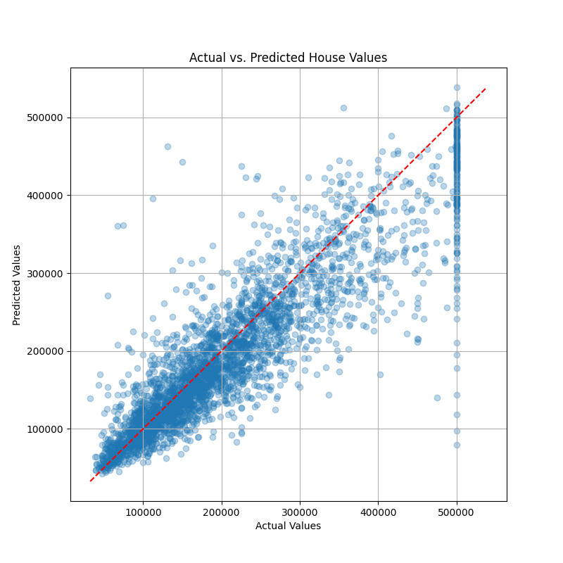
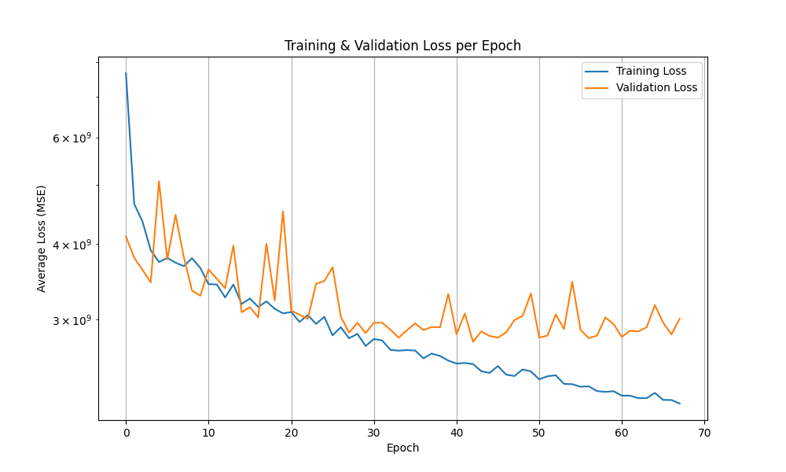

# Neural Network From Scratch + California Housing Regression

A two-part project that first builds a complete neural network library from scratch using only NumPy — implementing forward/backward propagation, loss functions, and mini-batch SGD by hand — then applies PyTorch to a real-world regression task: predicting California median house values with a hyperparameter-optimized deep network, achieving **R²=0.79** and **RMSE=$54,426** on the test set.

**Built for:** Demonstrating foundational understanding of how neural networks learn (gradient computation, weight updates, loss surfaces) alongside practical ML engineering (data pipelines, hyperparameter search, early stopping).

---

## Tech Stack

| Category | Technologies |
|---|---|
| **Language** | Python 3 |
| **Part 1 (From Scratch)** | NumPy (forward/backward pass, Xavier init, mini-batch SGD) |
| **Part 2 (Applied)** | PyTorch (nn.Module, DataLoader, Adam optimizer) |
| **Data Processing** | scikit-learn (KNNImputer, StandardScaler, OneHotEncoder, ColumnTransformer) |
| **Evaluation** | scikit-learn (RMSE, MAE, R², KFold cross-validation) |
| **Visualization** | Matplotlib |

---

## Architecture

### Part 1 — Neural Network Library (NumPy Only)

A fully functional deep learning framework built without any ML libraries — every gradient is computed by hand.

| Component | Implementation |
|---|---|
| **LinearLayer** | `forward: Wx + b`, `backward: dL/dW = x^T @ grad_z, dL/dx = grad_z @ W^T`, Xavier initialization |
| **SigmoidLayer** | Forward: `1/(1+exp(-x))`, Backward: `grad * σ(x)(1-σ(x))` |
| **ReluLayer** | Forward: `max(0, x)`, Backward: `grad * (x > 0)` |
| **MSELossLayer** | `mean((y_pred - y_target)²)` with analytical gradient |
| **CrossEntropyLossLayer** | Numerically stable softmax + negative log-likelihood |
| **Preprocessor** | Min-max normalization with reversible transform |
| **MultiLayerNetwork** | Stacks LinearLayers + activations, sequential forward/backward |
| **Trainer** | Mini-batch SGD with data shuffling, configurable epochs/batch size/LR |

Validated on Iris classification (4 features → 3 classes).

### Part 2 — California Housing Regression (PyTorch)

```
Raw Data (housing.csv)
       │
       v
┌──────────────────────────────────────────────────────┐
│  Preprocessing Pipeline (sklearn ColumnTransformer)   │
│  Numeric: KNNImputer(k=5) → StandardScaler           │
│  Categorical: SimpleImputer → OneHotEncoder           │
└──────────────────────┬───────────────────────────────┘
                       │
                       v
┌──────────────────────────────────────────────────────┐
│  NeuralNet (configurable architecture)                │
│  Rectangular: [256 → 256 → 256 → 256 → 256 → 1]    │
│  or Pyramid:  [128 → 64 → 32 → 16 → 8 → 1]         │
│  Activations: ReLU / LeakyReLU / Sigmoid              │
└──────────────────────┬───────────────────────────────┘
                       │
                       v
┌──────────────────────────────────────────────────────┐
│  Training Loop                                        │
│  Adam optimizer + MSE loss + early stopping           │
│  10-fold CV grid search over 7 hyperparameters        │
└──────────────────────────────────────────────────────┘
```

---

## Results

### Predictions vs Actual House Values

> Scatter plot of predicted vs actual median house values on the test set. Points along the red diagonal indicate accurate predictions.

### Training & Validation Loss

> Training converges within 68 epochs; early stopping prevents overfitting as validation loss plateaus.

### Test Set Performance

| Metric | Value |
|---|---|
| **RMSE** | $54,426 |
| **MAE** | $35,645 |
| **R²** | 0.79 |
| **Epochs** | 68 (early stopped from 1000) |

### Best Hyperparameters (via 10-fold CV Grid Search)

| Parameter | Value |
|---|---|
| Architecture | Rectangular [256 x 5 layers] |
| Activation | ReLU |
| Learning Rate | 0.01 |
| Weight Decay | 0.0 |
| Batch Size | 32 |

Searched over 864 combinations (2 LR x 2 WD x 3 layers x 4 neurons x 3 batch x 2 arch x 3 activation) with 10-fold CV = 8,640 total training runs.

---

## Project Structure

```
.
├── part1_nn_lib.py                  # From-scratch neural network library (NumPy)
├── part2_house_value_regression.py  # California housing regressor (PyTorch)
├── housing.csv                      # California housing dataset (20,640 samples, 10 features)
├── iris.dat                         # Iris dataset for Part 1 validation
├── part2_model.pickle               # Trained model checkpoint
├── log_regression.log               # Training log with per-epoch metrics
├── assets/                          # Visualizations for README
│   ├── predictions_vs_actuals.png
│   └── training_loss_curve.png
├── requirements.txt
├── .gitignore
└── README.md
```

---

## Getting Started

### Prerequisites

- Python 3.7+

### Installation

```bash
git clone https://github.com/<your-username>/neural-networks-from-scratch.git
cd neural-networks-from-scratch

pip install -r requirements.txt
```

### Run

```bash
# Part 1: From-scratch neural network on Iris
python part1_nn_lib.py

# Part 2: California housing regression
python part2_house_value_regression.py
```

Part 2 trains the model, evaluates on the test set, and saves prediction plots and loss curves. A pre-trained model (`part2_model.pickle`) is included for inference without retraining.

---

## Academic Context

Developed as coursework for **COMP70050 Introduction to Machine Learning** at Imperial College London (MSc Artificial Intelligence).

---

## Author

**Ethan Chia Wei Fong**
